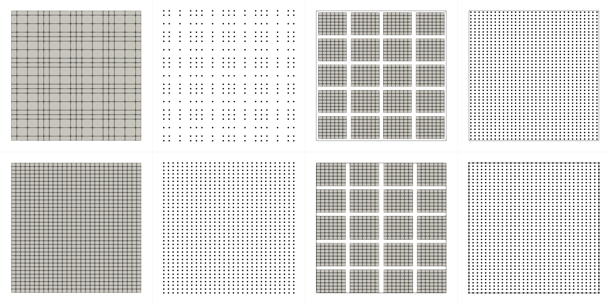

# box writer

This demo interpolate the solutions onto non-overlapping grids.

### Comparison

Nek5000 solves fields in GLL node. By default, the solutions are dumped onto
the nodal GLL grids.  Nek5000 also support `ifreguo=.true.` to interpolate the
solution onto uniform grid elements by elements.

However, these default modes include the endpoints in 1D distribution, which
means there are duplicated grid points on the interfaces between elements.

For machine learning with convolutional neural network, it works best if the
data is spacing uniformly, i.e., a box grid.  To avoid data waste, here we
provide two extra options to store the data.

- box-ubx: In each elements, use uniform grid excluding elements.
  Nek's ifreguo=T has uniform spacing for $[-1,1]$. Here, we simply change it to
  the uniform spacing for $(-1,1)$, excluding endpoints.

- box-bbx: The downside of box-ubx is, the boundary points couldn't be
  represented.  For boundary value problem, it will be crucial to have boundary
  points. `bbx` mode first rescale the element distribution such that the
  elements attached to the boundary is slightly thinner.  Then, the uniform
  spacing including the boundary can be achieved.

Here is the comparison:

| Method | 1D Spacing | Interface | boundary | #uniq points | Fig. |
|:---|:---:|:---:|:---:|:---:|:---:|
| Nek default   | piecewise GLL | yes | yes | E * N + 1 | top-left
| Nek ifreguo=T | uniform | yes | yes | E * N + 1 | bottom-left |
| box (imode=1) | uniform | no | no  | E(N+1) | top-right |
| box (imode=2) | uniform | no | yes | E(N+1) | bottom-right |



### Usage
Include `box_outfld.f` and call the API similar to `outpost/outpost2`
```
myoutpost_box(vx,vy,vz,pr,t,'aaa',imode)
myoutpost2_box(vz,vy,vz,pr,t,nfldt,'aaa',imode)
```

The extra parameter, `imode` represents two extra modes
- imode = 1 (ubx mode): 
  uniform box mesh, no-interface, no-bdry.

  This mode is also general that does not require a box mesh.

- imode = 2 (bbx mode):
  This mode require the original mesh to be a uniform box mesh. If not, user
  should do a gfldr in advance.  In `usrdat2`, specify the `nelx`, `nely` and
  `nelz` (3D) and call `box_outfld_rescale_mesh` for auto scaling.
  

### Demos

There are two usr files and two folders for 4 combinations.

```
demo_a_ubx.usr # for imode = 1 + default nek outpost
demo_b_bbx.usr # for imode = 2

demo2d/        # a 2d box mesh, E = 4 x 5
demo3d/        # a 3d box mesh, E = 4 x 5 x 4
```

User can simply do
```
cd demo2d;
makenek ../demo_a_ubx
nekbmpi eddy_uv2 4
```
